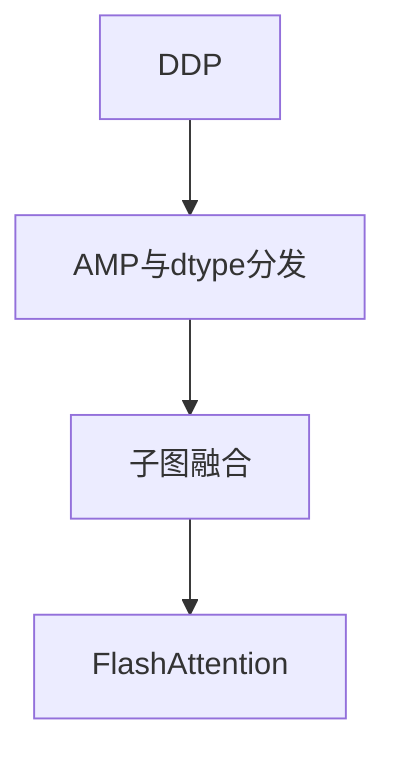

# 性能与规模演进路线图（阶段四）

对应待办清单中长期项：在**核心语义与测试稳定**的前提下按序落地。

## 1. 混合精度（AMP）

- **现状**：[`src/amp.jl`](../src/amp.jl) 提供 `GradScaler`、`@autocast` 等占位与部分逻辑。
- **下一步**：与 `dispatch_op` 的 **dtype 维度**联动；定义主权重 FP32、前向 FP16/BF16 的累加精度策略；补充数值测试。

## 2. 子图 trace 与融合

- **现状**：[`src/compile/trace.jl`](../src/compile/trace.jl)、[`src/compile/fusion.jl`](../src/compile/fusion.jl)。
- **下一步**：扩展可融合算子集合（逐元链）；可选生成单 kernel 或调用手写 fused API。

## 3. FlashAttention / Fused Softmax

- **目标**：长序列注意力降显存与带宽；需在 CUDA 扩展中增加专用 kernel 或依赖外部库，并与 `TransformerBlock` 对接。

## 4. 多卡（DDP）

- **现状**：[`src/distributed/ddp_stub.jl`](../src/distributed/ddp_stub.jl)、设计备忘 [`ddp-design.md`](ddp-design.md)。
- **下一步**：进程组、AllReduce、与 `backward`/`step!` 的顺序约定；桶化梯度合并。

## 依赖关系（简图）

DDP 可与 AMP 并行规划，但生产环境通常先稳定单卡 AMP 再扩多卡。
